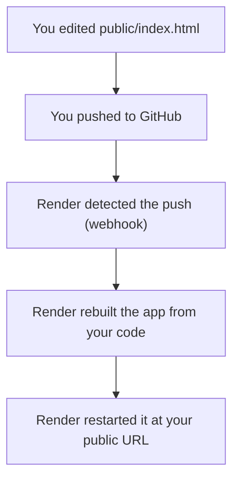
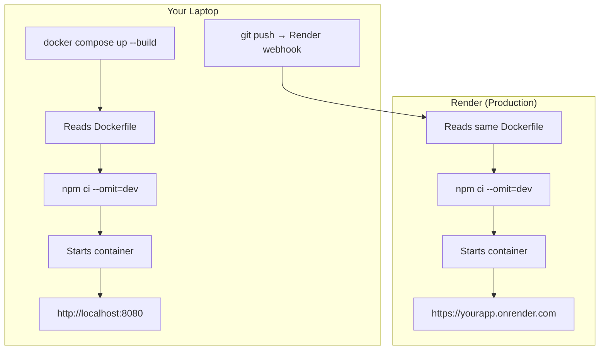

[](https://classroom.github.com/open-in-codespaces?assignment_repo_id=23181131)
# 🚀 Deploy Now Workshop

> Deploy a real app to the internet. Make a change. Watch it update. Then learn how it works.

👉 **If you finish Part 1, you've done the most important thing today.**

---

## 🎯 What You'll Do

| Part | When | Goal |
|------|------|------|
| **Part 1 — Deploy** | First ~20 min | Your app is live at a public URL |
| **Part 2 — Iterate** | Next ~30 min | You make a change and watch it redeploy |
| **Part 3 — Docker** | Lab (1h 50m) | You run it locally and understand how it works |

---

## 🟢 Part 1 — Get It Live

### Step 1 — Open your GitHub Classroom repo

Your instructor shared a GitHub Classroom assignment link. Clicking it automatically created your own copy of this repo at `github.com/YOUR_USERNAME/deploy-now-workshop`.

Open that repo now — it's where you'll make all your changes.

---

### Step 2 — Create a Render account

Go to [render.com](https://render.com) and sign up with GitHub. Free tier works fine.

---

### Step 3 — Create a Web Service

In the Render dashboard: **New + → Web Service → connect your repo**

Configure it:

| Setting | Value |
|---------|-------|
| Name | `yourname-deploy-workshop` |
| Branch | `main` |
| Runtime | **Docker** |
| Instance Type | **Free** |

No environment variables needed. Click **Create Web Service**.

---

### Step 4 — Wait for the deploy

Watch the build log. When you see:

```
==> Your service is live 🎉
```

Click the URL at the top of the page.

---

### ✅ Part 1 Checkpoint

> You can see the welcome page at `https://yourname-deploy-workshop.onrender.com`.
>
> Share your URL with a neighbor.

---

## 🔄 Part 2 — Make It Yours

### Step 1 — Edit `public/index.html`

Open it in your editor or directly on GitHub (click the pencil icon).

Find the clearly marked section:

```html
<!-- ================================================================
     👋 STUDENT EDIT ZONE — CHANGE THIS SECTION!
     ================================================================ -->
```

---

### Step 2 — Change your name and message

```html
<h1>👋 Hello from <strong>Ada Lovelace</strong>!</h1>
<p class="tagline">I just deployed something real! 🚀</p>
```

**Bonus:** Change the banner color. Find this in the `<style>` block:

```css
/* ✏️ CHANGE THIS COLOR */
background: #3b82f6;
```

Try: `#e11d48` (red) · `#16a34a` (green) · `#9333ea` (purple)

---

### Step 3 — Commit and push

**On GitHub (easiest):** scroll down, write a commit message, click **Commit changes**.

**Locally:**
```bash
git add public/index.html
git commit -m "feat: update welcome message"
git push origin main
```

---

### Step 4 — Watch Render redeploy

Go to your Render dashboard. A new deploy starts automatically when Render detects your push. Wait ~1–2 minutes, then refresh your URL.

---

### ✅ Part 2 Checkpoint

> Your name is live on your public URL.
>
> Every `git push` to `main` → Render rebuilds and redeploys. That's the loop.

---

## 🧠 What Just Happened?

Here's the full picture of what ran automatically:



This push → build → deploy pattern is how production apps work at every scale.

You didn't need to understand this to deploy. But now you do.

---

## ⚫ Part 3 — How This Actually Works (Lab)

> Complete Parts 1 and 2 before starting this section.

In Parts 1 and 2, Render built and ran your app automatically.
What it actually did was read the `Dockerfile` in this repo and run your app inside a **container**.

**Docker** packages your app and its dependencies into a portable environment that runs the same everywhere — your laptop, Render, AWS, anywhere.

That's why it worked the first time without any configuration.

---

### Prerequisites

Install **Docker Desktop**: [docker.com/products/docker-desktop](https://www.docker.com/products/docker-desktop)

Verify:
```bash
docker --version
docker compose version
```

**Don't want to install locally?** Open your repo in GitHub Codespaces instead (`.devcontainer` is already configured).

---

### Step 1 — Clone your repo

```bash
git clone https://github.com/YOUR_USERNAME/deploy-now-workshop.git
cd deploy-now-workshop
```

---

### Step 2 — Read the Dockerfile before running it

Open `Dockerfile`. Notice the order:

```dockerfile
# Copy package files FIRST
COPY package*.json ./
RUN npm ci --omit=dev

# THEN copy the rest of the app
COPY . .
```

**Why this order?** Docker caches each step. If `package.json` hasn't changed, Docker skips `npm install` entirely on the next build. Copying everything first would bust that cache on every change.

---

### Step 3 — Build and run locally

```bash
docker compose -f compose.local.yml up --build
```

This builds an image from the Dockerfile and starts a container. When you see:

```
app-1  | Workshop app running → http://localhost:8080
```

Open [http://localhost:8080](http://localhost:8080).

**Same app. Same container image. Running locally instead of on Render.**

---

### Step 4 — Explore the running container

Open a new terminal tab while the app is running:

```bash
# List running containers
docker ps

# Open a shell inside the container
docker exec -it deploy-now-workshop-app-1 sh
ls /app
cat /app/server.js
exit

# View logs
docker compose -f compose.local.yml logs -f

# Stop everything
docker compose -f compose.local.yml down
```

---

### Step 5 — Make a change and rebuild

1. Edit `public/index.html`
2. Stop the container: `Ctrl+C`
3. Rebuild and restart:
   ```bash
   docker compose -f compose.local.yml up --build
   ```
4. Refresh [http://localhost:8080](http://localhost:8080)

> Files are copied into the image at build time, so you need to rebuild to see changes. In a real dev workflow you'd mount a volume (see Challenge 1 below).

---

### ✅ Part 3 Checkpoint

> Your app runs in Docker locally. You understand:
> 1. The same `Dockerfile` ran on Render in production and runs here locally
> 2. Layer caching means rebuilds are fast when only your code changes

---

### How local maps to production



Same Dockerfile. Same process. Different infrastructure. That's the point of containers.

---

### Key concepts

**Image vs Container**

| Concept | Analogy | In practice |
|---------|---------|-------------|
| **Image** | A recipe | Built from Dockerfile, stored on disk |
| **Container** | The meal | A live running process from the image |

**Port mapping** — `8080:8080` means "forward port 8080 on your laptop to port 8080 inside the container."

**Environment variables** — the app reads `PORT` from the environment. Render sets it automatically. Docker Compose sets it in `compose.local.yml`. The code doesn't care where it comes from.

---

### Extension challenges

**Challenge 1 — Volume mount (live reload)**

Add this to `compose.local.yml` under the app service so HTML changes appear without rebuilding:
```yaml
volumes:
  - ./public:/app/public
```

**Challenge 2 — Add a new page**

Add a new HTML file to `public/` and link to it from `index.html`. Push and watch it deploy.

**Challenge 3 — Add an API route**

Open `server.js` and add a new Express route that returns JSON. Test it at `/api/your-route`.

---

## 🔧 Troubleshooting

**Deploy failed on Render**
Check the Deploy Logs in Render. Common causes: Dockerfile syntax error (the log shows the line), or a missing dependency.

**I pushed but Render didn't redeploy**
Make sure you pushed to `main`. Check Render dashboard → your service → **Auto-Deploy** is enabled.

**My change isn't showing up**
Did you edit `public/index.html`? Did you push? Run `git status` — it should show nothing pending. Check that the Render deploy finished.

**Docker Compose fails locally**
Make sure Docker Desktop is running. Run `docker compose -f compose.local.yml down` first, then `up --build`. Port conflict? Change `8080:8080` to `8081:8080` in `compose.local.yml`.

**The site takes forever to load**
Free Render instances sleep after 15 minutes idle. The first request wakes it up — expect 30–60 seconds. It's not broken.
